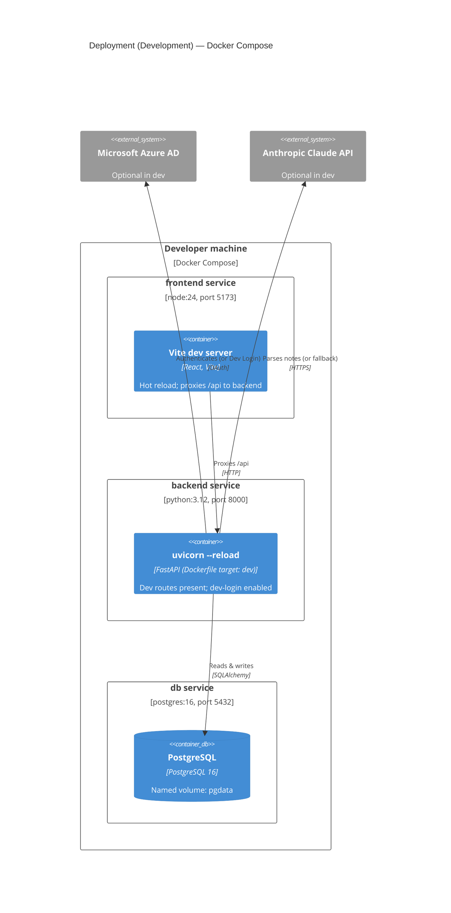

# C4 Deployment — Development (Docker Compose)

How the containers run locally (`docker-compose.yml`). All three services are source-mounted
for hot reload.

**Notes**

- Plain HTTP, no TLS. Frontend on `:5173`, API on `:8000/api`, Swagger on `:8000/docs`.
- `ENABLE_DEV_LOGIN=true` (and `VITE_ENABLE_DEV_LOGIN=true`) enable the "Dev Login (Admin)"
  button, so Azure AD and the Claude key are both optional locally.
- Config comes from `.env`.
