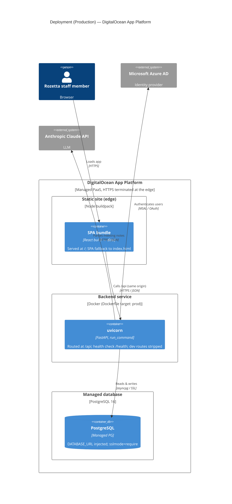

# C4 Deployment — Production (DigitalOcean App Platform)

How the containers run in production (`.do/app.yaml`). Fully managed PaaS: no server, no
Compose, no self-run reverse proxy.

**Notes**

- SPA and API share one origin → no CORS, JWT travels normally; App Platform terminates HTTPS.
- Frontend is a buildpack **static site** (not the `frontend/Dockerfile`); backend is the
  Dockerfile's final `prod` stage with its CMD overridden by `run_command`.
- Deploys are push-to-`main` (`deploy_on_push: true`). The DB is currently the dev-grade tier
  (`production: false`); flip to `true` before real data lands.
