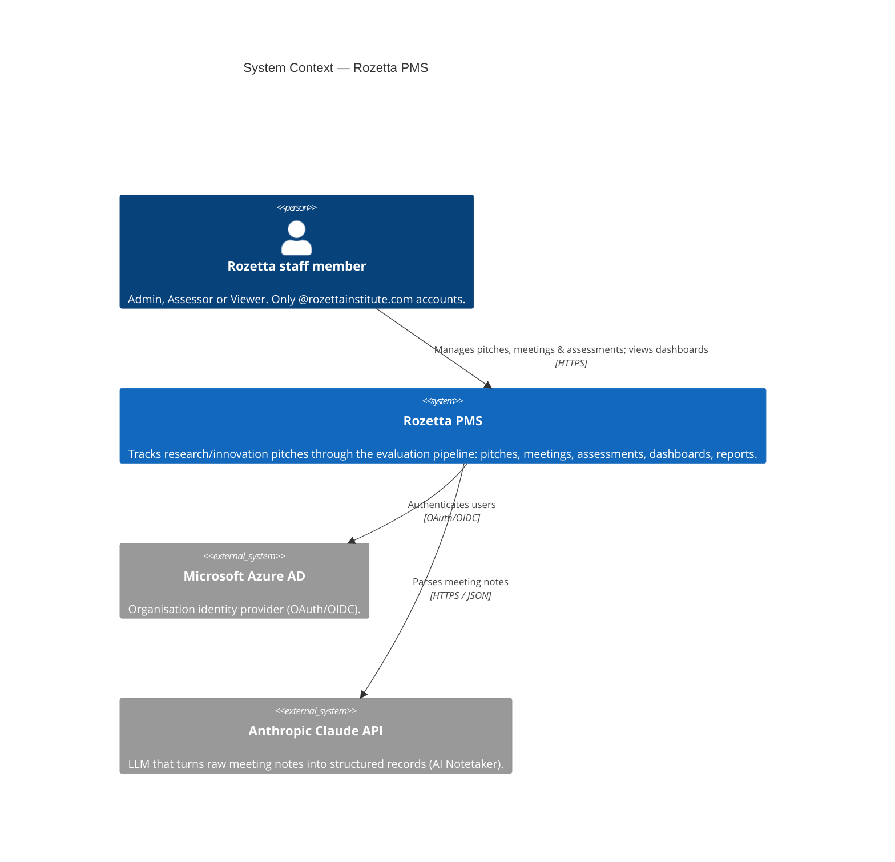

# C4 Level 1 — System Context

Who and what interacts with Rozetta PMS, at the highest level.

**Notes**

- Staff are modelled as one *Person* with the three roles; split into separate actors only if a
  diagram's audience needs the distinction.
- Claude is optional at runtime — without `ANTHROPIC_API_KEY` the system falls back to a basic
  text parser (a property of the system, not a separate external dependency).
