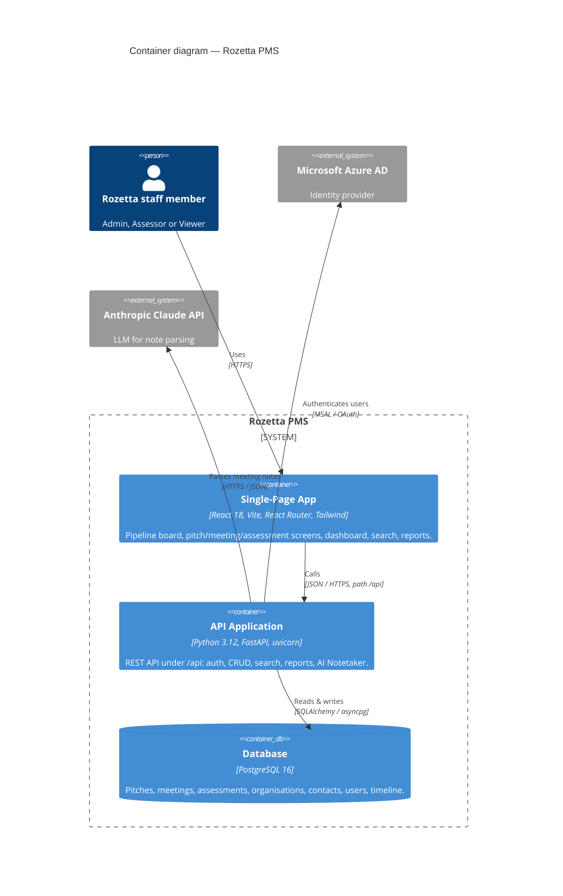

# C4 Level 2 — Containers

Zooms into the Rozetta PMS box: the runnable/deployable units and how they communicate.
This view is **topology-agnostic** — how each container is served differs between dev and prod
(see the [deployment views](./deployment-dev.md)), but the logical containers are the same.

**Notes**

- The SPA only ever talks to the API at `/api`. In dev this is the Vite proxy; in prod it's a
  same-origin route — either way the browser sees one origin.
- The backend issues a JWT after the Azure AD exchange; the SPA stores it in `localStorage` and
  sends it on each `/api` call.
