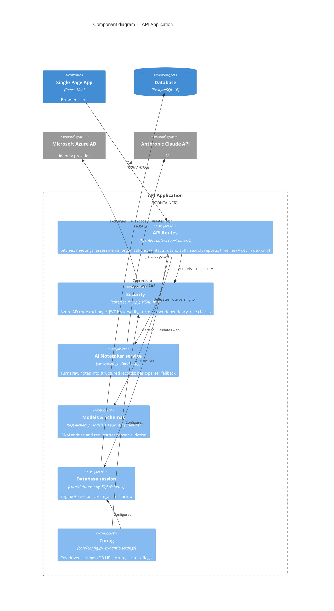

# C4 Level 3 — Components (API Application)

Zooms into the **API Application** container (`backend/app/`). Other containers are shown as
context only.

**Notes**

- `Models & Schemas` collapses two code-level packages (`models/` SQLAlchemy + `schemas/`
  Pydantic) into one component to keep the diagram at component altitude.
- The `dev` routes component exists only in the dev image; the `prod` Docker stage removes
  `dev.py`.
- Tables are created on startup via `Base.metadata.create_all` (Alembic available for managed
  migrations).
